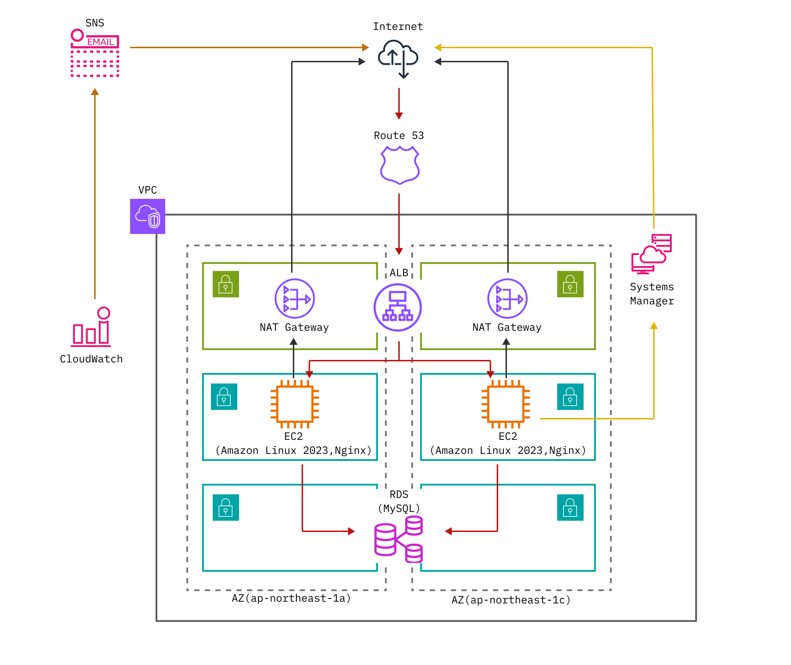

## 概要
地域毎の治安や利便性を可視化し、住環境を選択する際の一助とすることを狙いとして、各地域の居住者の口コミの内容や数量を管理するWebアプリケーションを作成。

## 現在の構築状況
- TerraformでVPC内リソースをIaC化 
コードのセルフレビューおよび、リソース毎の疎通検証を実施。 
- FastAPI(Python)を用いたAPI構築を開始
- IAM RoleでのSSMの接続対応(IaC化済)

## アーキテクチャ方針
### アーキテクチャ方針図

本成果物の作成軸は「設計理解」と「コスト」である。 
アプリケーションの可用性と設計コストはトレードオフの関係にあるため、作成軸を元に可用性の確保基準を考慮した。

### リージョン
単一リージョン(東京,ap-northeast-1)
- メリット：管理コスト低下
- デメリット：リージョン障害時の可用性確保不可

### Availability Zone
2AZ構成(ap-northeast-1a,ap-northeast-1c)
- メリット：AZ障害時の可用性確保
- デメリット：運用コストの増加

設計の軸として「コスト」を置いていたが、「設計理解」として学習を深めるためにNAT Gatewayの分割配置、ならびにRDSのMulti-AZを実構築することを優先して2AZ構成とした。

## 使用技術一覧
インフラ構成要素の比較、選定理由はこちら 
[各サービスの比較、選定理由](docs/service-selection.md)
 
### 技術スタック
- AWS（クラウド）
- Terraform v1.15.3（IaC化)
- Nginx(Webサーバー/リバースプロキシ）
- FastAPI（API構築)
- Figma（構成図デザイン）
- GitHub（ソースコード管理）

### 開発環境
- Debian GNU/Linux 12 (bookworm)
- Visual Studio Code 1.118.1

## NW構成
2AZの3層構成(ALB,EC2,RDS)を単一リージョンで作成。
- 1AZにつきPublic Subnetを1個とPrivate Subnetを2個配置
- VPC外のサービスとしてRoute 53,CloudWatch(Alarm),SNSを採用
- EC2の実行環境はSSMを経由して使用するため22ポート(SSH)の開放不要

詳細なNW構成はこちら 
[NW構成](docs/design-network.md)

## Terraform(IaC)
セルフレビュー方法、ならびにリソースの疎通確認結果はこちら 
[セルフレビュー、検証結果](docs/verification.md)
 
### 現在のIaC化状況
インフラ基盤となる3層構成(ALB/EC2/RDS)に関わる主要リソースのIaC化が完了。 
今後はCloudWatch Alarms、SNS、Route 53といったVPC外リソースのIaC化を予定。

IaC化済 
| リソース名 | ファイル| 
|:-----:|:-----:|
| Provider | [provider.tf](terraform/provider.tf)| 
| VPC | [vpc.tf](terraform/vpc.tf)| 
| Subnet | [subnet.tf](terraform/subnet.tf)|
| IGW | [igw.tf](terraform/igw.tf)|
| NAT Gateway | [nat.tf](terraform/nat.tf) |
| Routing (association)| [route.tf](terraform/routing.tf)|
| Security Group | [security_group.tf](terraform/security_group.tf)|
| IAM (SSM Only) | [iam.tf](terraform/iam.tf)| 
| ALB | [alb.tf](terraform/alb.tf) |
| EC2 | [ec2.tf](terraform/ec2.tf)|
| RDS | [rds.tf](terraform/rds.tf)|

IaC化中 
| リソース名 | ファイル| 
|:-----:|:-----:|
| Route 53 | [route53.tf](terraform/route53.tf)| 
| SNS | [sns.tf](terraform/sns.tf)|
| CloudWatch (Alarms) | [cloudwatch.tf](terraform/cloudwatch.tf)|

## 障害時の運用設計
CloudWatch AlarmsとSNSを連携させて 
障害発生時に通知することで、障害の早期発見と迅速な復旧対応へ繋げている。
 
 
運用設計書はこちら 
[運用設計書](docs/trouble-shooting.md)

## 開発記録
2026年3月から検討開始。 
2026年4月にGitHubで成果物管理を始めてからは構築状況に応じて継続修正を行っている。 
 
2026年6月のTerraform導入時にGit管理で障害が発生し、原因究明を行う前に誤ってGitの初期化を実施。 
結果、それ以前のコミット履歴が削除された。 

この際の反省点を生かして、本成果物では以下を留意して開発を実施している。
 

- 障害発生時の原因分析、対応策検討
- 復旧可能状態の維持(スナップショット)

## 今後の展望
以下、優先順位ごとに記載。
1. TerraformでVPC外リソースのIaC化 
(Route 53,SNS,CloudWatch)
2. SSMの通信経路変更 
(NAT Gateway → VPC Endpoint)
3. FastAPI(Python)でのAPI構築
4. アプリケーションのマルチリージョン化
5. Route 53の自動フェイルオーバー有効化

## ドキュメントへのリンク一覧
- [各サービスの選定理由](docs/service-selection.md) 
ロードバランサー、サーバー、DB、ならびにインスタンスタイプとWebサーバーを比較した上で選定理由を記載。

- [NW構成](docs/design-network.md) 
セキュリティを鑑みたサブネット配置やCIDR、SGについて記載。補足としてSSM経由でのEC2接続について説明。

- [セルフレビュー、検証結果](docs/verification.md) 
前半はterraform fmt / validate やTFLintを用いたセルフレビューと頻出したエラーを記載。後半は作成したコードで行った経路別の疎通検証結果を記録している。

- [運用設計書](docs/trouble-shooting.md) 
インスタンス障害、AZ障害、リージョン障害時の現段階の障害検知と可用性を確保するための対策を記載。補足としてアプリケーション障害時の対応も述べている。
