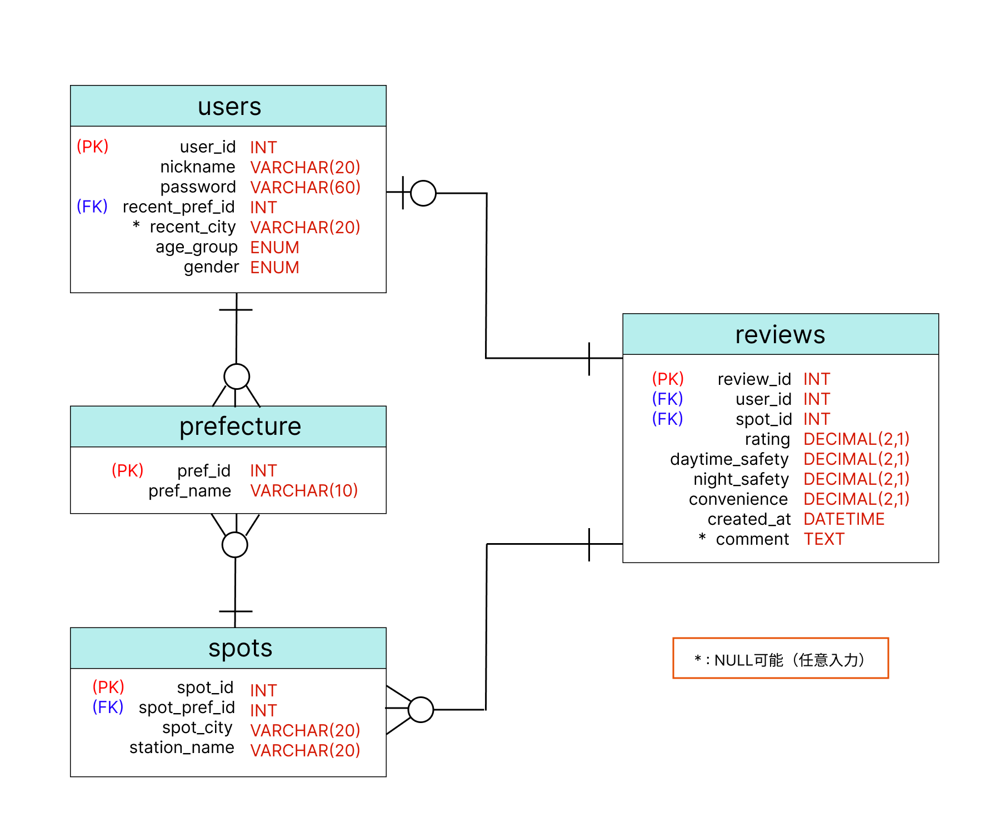

## API実装
API実装に関する追加ライブラリとしてFastAPIとUvicornを使用。 
疎通検証を実施するため、最初に口コミの一覧表示(GET, /reviews)のAPI実装を行い、その後は必要に応じたAPIを作成する予定としている。

## DB設計

エンティティとカラムの確定後、多重度に応じてテーブル同士の関係性を決定。データ型とNULL可否を確定させてからER図を作成。 
 
その後、DDLを用いてテーブルを構築。構築したテーブルにDMLでサンプルデータを入力し、FastAPIからDQL(SELECT文)を実行し、格納されたデータを取得する。

### DDLを用いたテーブル構築
CREATE TABLEを用いてユーザー(users)、場所(spots)、都道府県(prefectures)、口コミ(reviews)の4つのテーブルを構築。 
 
なお、TerraformでのRDSリソース作成時にDBを作成するため、DDLではCREATE DATABASEを実施していない。 
 
以下、各テーブルのDDLを記載。
| テーブル名 | ファイル| 
|:-----:|:-----:|
| ユーザー(users) | [users.sql](../db/ddl/users.sql)| 
| 場所(spots) | [spots.sql](../db/ddl/spots.sql)| 
| 都道府県(prefectures) | [prefectures.sql](../db/ddl/prefectures.sql)| 
| 口コミ(reviews) | [reviews.sql](../db/ddl/reviews.sql)| 

### DMLを用いたサンプルデータ入力
prefecturesテーブルの「pref_name」は都道府県名を表しているため、マスタデータとして実際の都道府県の名称を登録。 他のカラムはトランザクションデータとしてサンプルデータを入力した。 
 
加えて、usersテーブルのpasswordに関しては認証情報の流出を防ぐため、Pythonの追加ライブラリであるpasslib[bcrypt]を用いてハッシュ化を実施。 
 
以下、各テーブルのDMLを記載。
| テーブル名 | ファイル| 
|:-----:|:-----:|
| ユーザー(users) | [users.sql](../db/seed/users.sql)| 
| 場所(spots) | [spots.sql](../db/seed/spots.sql)| 
| 都道府県(prefectures) | [prefectures.sql](../db/seed/prefectures.sql)| 
| 口コミ(reviews) | [reviews.sql](../db/seed/reviews.sql)| 

### DQLを用いた格納データの取得
呼ばれたAPIに応じた処理を実施。 
疎通検証の実施に伴って口コミの一覧表示(GET, /reviews)のAPIを実装するため、SELECT文でreviewsテーブルの全カラムを取得するDQLを記述した。 
 
以降はSELECT文に加えてORDER BY, LIMITなどを用いることで、実装したAPIに応じたデータを取得する予定。
