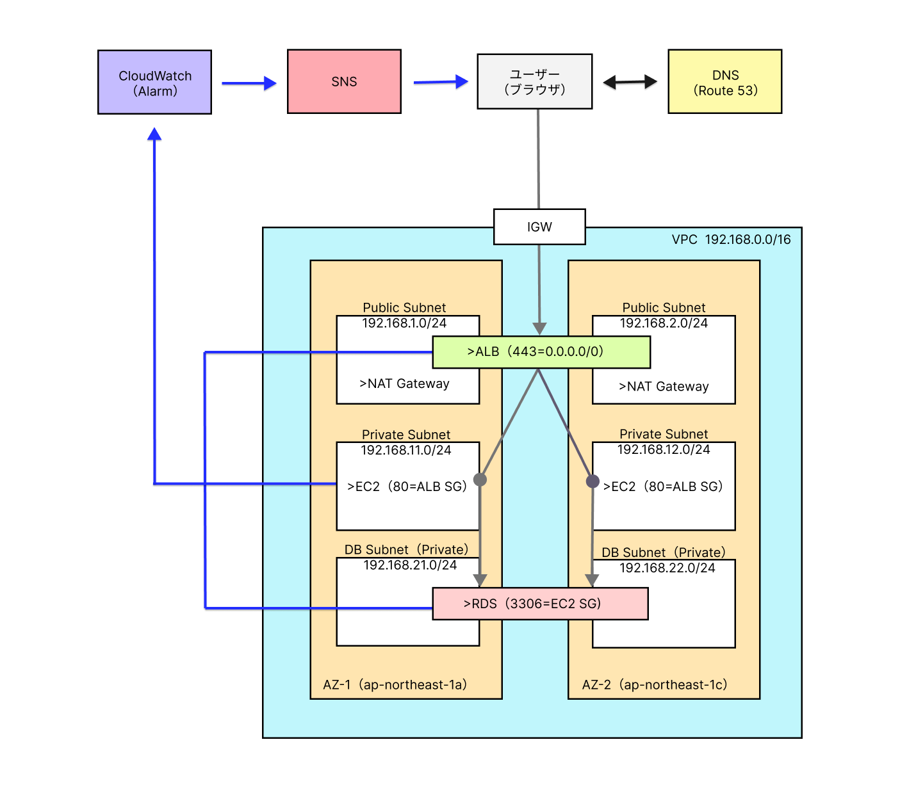

## 本成果物のNW構成

 

### 構成図の概要 
2AZの3層構成(ALB,EC2,RDS)を単一リージョンで作成。
- 1AZにつきPublic Subnetを1個とPrivate Subnetを2個配置
- VPC外のサービスとしてはRoute 53,CloudWatch(Alarm),SNSを採用

本ドキュメントはNW構成の説明資料のため 
詳細なサービス選定理由は以下に記載。 
[サービス選定理由](service-selection.md)

### 各サービスのサブネット配置 
- ALB:Public Subnet 
クライアントからのWeb通信（HTTP/HTTPS）のリクエストを受け入れるため、直接インターネット接続可能なPublic Subnetに配置 

- EC2:Private Subnet 
外部接続が不要であり、かつ接続経路を絞ることでセキュリティ性の向上を図るため 直接のインターネット接続不可であるPrivate Subnetに配置 

- RDS:Private Subnet 
外部接続が不要であり、かつ接続経路を絞ることでセキュリティ性の向上を図るため 
直接のインターネット接続不可であるPrivate Subnetに配置 

### サブネット/VPCのCIDR 
- VPC=/16 
今後サービスの拡張で追加のサブネットが必要となった際を考慮して /16 で作成 

- サブネット=/24 
現在は各サービスでIP使用数10個未満だが、スケールアウトやサービス拡張に伴う使用量追加を考慮して 
IP使用数を余分に確保するため /24 で作成 

### 各SGの設定理由 
- Internet → ALB（443=0.0.0.0/0） 
全てのWeb通信を受け入れ可能とすると通信傍受の可能性が高まり通信者の安全性が確保できないため、TLSで通信の暗号化、安全性を確保したHTTPS通信のみ受信可能とする 

- ALB → EC2（80＝ALB SG） 
TLSハンドシェイクを含むHTTPS通信（クライアント⇔ALB間）の終端がALBであり、ALBによって復号が行われることから内部では負荷軽減のためHTTP通信を使用 
受け入れるインバウンド通信をALBのSGのみとし、通信経路を限定することでセキュリティ性を向上 

- EC2 → RDS（3306=EC2 SG） 
受け入れるインバウンド通信をEC2のSGのみとすることで、通信経路を限定しセキュリティ性を向上 
今回はMySQLを使用するため、3306ポートを指定 
